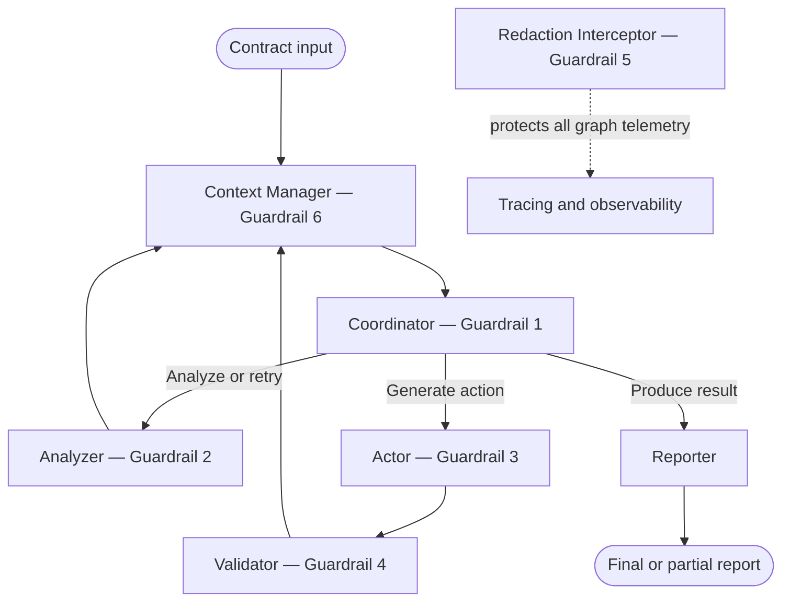

# Architecture Design

## Legal Contract Review Orchestrator

**Status:** Final  
**Contract version:** 1.0.0

## 1. Purpose

This document defines the architecture of the Legal Contract Review Orchestrator, including its graph topology, component interfaces, shared state flow, routing logic, rollback behavior, and termination conditions.

The system uses a central Coordinator to manage four functional components: Analyzer, Actor, Validator, and Reporter. A Context Manager controls graph history, while a Redaction Interceptor protects telemetry. The complete state schema is defined in [`contract.py`](contract.py).

---

## 2. System architecture



The system is not a linear pipeline. The Analyzer and Validator return through the Context Manager before the Coordinator selects another route. Workers update the shared state but do not choose which component runs next.

The executable graph edges are:

```text
context_manager → coordinator
coordinator → analyzer
coordinator → actor
coordinator → reporter
analyzer → context_manager
actor → validator
validator → context_manager
reporter → END
```

Both successful reporting and forced partial output route through the Reporter.

---

## 3. Component responsibilities

| Component | Responsibility | Reads | Writes |
|---|---|---|---|
| Coordinator | Selects the next route and enforces graph termination | Routing, validation, rejection, and execution fields | `next_route`, `round_number`, `rejection_flag`, `error_log` |
| Analyzer | Extracts and evaluates risk-bearing clauses | `raw_input` | `analysis_payload`, `is_validated`, `analysis_retry_count`, rejection fields |
| Actor | Produces and authorizes mocked redline actions | `analysis_payload`, `is_validated` | `sanitized_tool_calls`, `execution_state`, rejection fields |
| Validator | Checks Actor output before reporting | Analysis, tool-call, and execution fields | `validation_notes`, normalized execution state, rejection fields |
| Reporter | Produces a complete or partial report | Analysis, execution, validation, routing, and error fields | `final_report` |
| Context Manager | Bounds the recorded graph history | `messages`, `token_count` | `messages`, `token_count` |
| Redaction Interceptor | Sanitizes tracing data without modifying graph state | Callback inputs, outputs, errors, metadata, and tags | Redacted telemetry only |

All nodes receive and return the shared Pydantic `AgentState`.

---

## 4. Shared state design

[`contract.py`](contract.py) is the frozen integration contract. Its fields are grouped as follows:

| State group | Fields |
|---|---|
| Task input | `task_domain`, `raw_input` |
| Routing | `round_number`, `next_route` |
| Validation and rejection | `is_validated`, `rejection_flag`, `rejection_reason_history`, `error_log` |
| Analyzer output | `analysis_payload`, `analysis_retry_count` |
| Actor output | `sanitized_tool_calls`, `execution_state` |
| Validator and Reporter output | `validation_notes`, `final_report` |
| Context management | `messages`, `token_count` |

The state model uses `extra="forbid"`, so nodes cannot introduce undeclared fields.

Analyzer output is validated through the nested `ContractAnalysis` and `ClauseRisk` models before being stored in `analysis_payload`. These models enforce required fields, permitted enum values, unique clause identifiers, risk consistency, and source grounding.

---

## 5. Coordinator routing logic

The Coordinator evaluates state in the following order:

```python
if round_number >= MAX_ROUNDS:
    route = "partial_output"
elif rejection_flag and last_two_rejection_reasons_are_identical:
    route = "partial_output"
elif rejection_flag:
    round_number += 1
    route = "analyzer"
elif not is_validated:
    route = "analyzer"
elif not execution_state:
    route = "actor"
else:
    route = "reporter"
```

`MAX_ROUNDS` is set to `5`.

The Coordinator is deterministic and does not call an LLM. Centralizing routing prevents individual workers from bypassing retry or termination rules.

---

## 6. Retry and rollback behavior

### Analyzer failure

The Analyzer validates model output against the structured schema and source contract. If validation fails, it returns the validation feedback to the model once.

This self-correction occurs inside the Analyzer and is recorded in `analysis_retry_count`. It does not increment the graph-level `round_number`.

If the second attempt also fails, the Analyzer clears its payload, sets `rejection_flag`, records the reason, and returns control to the Coordinator.

### Actor failure

The Actor validates every requested tool call against an allowlist and permission matrix before execution. Only mocked tools are available.

An unauthorized or malformed request produces a blocked execution state and sets `rejection_flag`. The fixed graph edge still sends the result to the Validator, which converts it into the standard rollback path.

### Validator failure

The Validator rejects malformed, inconsistent, unsafe, or ungrounded Actor output. On rejection, it:

- Clears `execution_state`
- Clears `sanitized_tool_calls`
- Sets `is_validated = False`
- Sets `rejection_flag = True`
- Records the validation reason

The Coordinator then returns the graph to the Analyzer.

### Successful validation

When validation succeeds, the Validator normalizes the execution state and records its approval in `validation_notes`. The Coordinator then routes to the Reporter.

---

## 7. Termination behavior

The graph terminates through the Reporter in one of two states.

### Complete report

A complete report is produced when the analysis is validated, the Actor has completed its mocked actions, and the Validator has approved the execution state.

### Partial report

A `PARTIAL -- MANUAL REVIEW REQUIRED` report is produced when:

- `round_number` reaches five; or
- The same rejection reason occurs twice consecutively.

The partial report includes the most recent error and the number of graph-level rounds attempted.

---

## 8. Global graph layers

### Context Manager

The Context Manager runs at graph entry and before every Coordinator re-entry. Worker wrappers record graph turns in `messages`, after which the Context Manager estimates the window size and compresses history when necessary.

Compression prioritizes older tool outputs, folds older turns into one bounded rolling summary, and preserves the most recent turns. It modifies only `messages` and `token_count`.

### Redaction Interceptor

The Redaction Interceptor is attached through the graph invocation configuration rather than implemented as a graph node. It redacts telemetry inputs, outputs, errors, metadata, and tags without modifying the working state.

If tracing is enabled, the tracing-route audit prevents an unredacted telemetry route from operating alongside the protected route.

---

## 9. Implementation configuration

`main_system.py` assembles the graph through injectable node callables:

```python
build_graph(
    analyzer=analyzer_stub,
    actor=actor_node,
    validator=validator_node,
    context_manager=context_manager_node,
    record_history=True,
)
```

The default entry point uses `analyzer_stub` for deterministic offline execution. The complete guarded Analyzer can be injected using `student_2_silent.snippet.analyzer_node` and is demonstrated in `student_2_silent/demo_live_graph.py`.

Dependency injection allows tests to substitute guarded, unguarded, malformed, or adversarial components without changing the graph topology.

---

## 10. Final architecture decisions

The final architecture uses one frozen shared state, one deterministic routing authority, bounded Analyzer self-correction, graph-level rollback to the Analyzer, centralized context management, and boundary-level telemetry redaction.

Implementation details and guardrail alternatives are documented in [`DESIGN_DOCS.md`](DESIGN_DOCS.md), while setup instructions, team responsibilities, execution commands, and repository organization are provided in [`README.md`](README.md).
