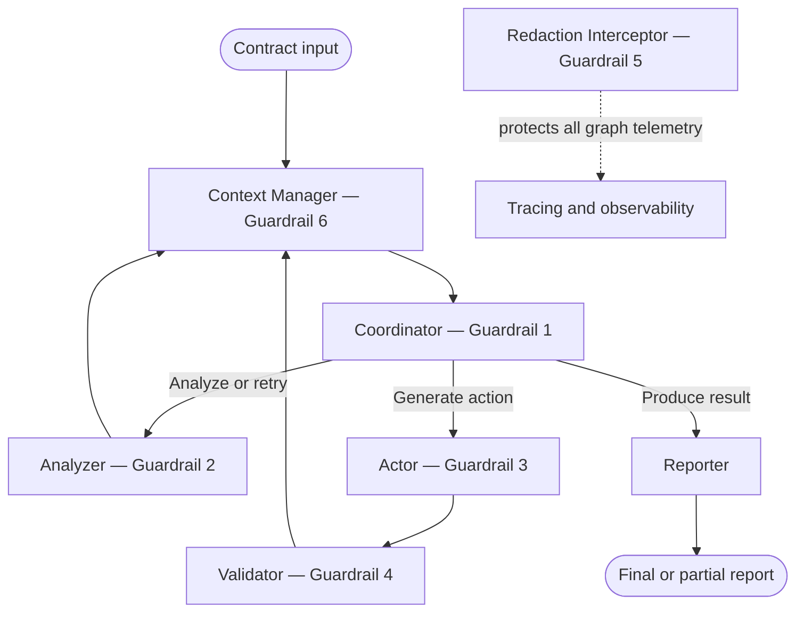

# Orchestrator — Safe Multi-Agent Legal Contract Review

A contract-review system built with Python, LangGraph, LangChain Core, and Pydantic. The system coordinates specialized agents that analyze clauses, propose revisions, validate outputs, and produce a structured report.

Its central design goal is safe orchestration. Six code-level guardrails address six common multi-agent failure modes:

1. Infinite coordination loops
2. Silent hallucinations
3. Unauthorized tool execution
4. Downstream cascade failures
5. Sensitive-data leakage through telemetry
6. Context-window and token-budget explosion

These controls are enforced through state validation, deterministic routing, permission checks, sanitization, redaction, and context management—not through prompt instructions alone.

---

## Problem and domain

Legal contract review is a useful multi-agent domain because orchestration failures have clear consequences:

| Failure mode | Potential consequence |
|---|---|
| Infinite loop | The review consumes time and tokens without producing a result |
| Silent hallucination | The system reports a clause or risk that is not present in the contract |
| Rogue tool execution | An agent performs an unauthorized action or writes an unapproved change |
| Cascade failure | Malformed output reaches another worker and corrupts later stages |
| Privacy leak | Client names, contract terms, or credentials appear in telemetry |
| Context explosion | A long review exceeds the model context window or token budget |

The system accepts raw contract text and produces either:

- A structured legal-review report containing clause analysis, risks, redlines, and validation notes; or
- A partial report marked `MANUAL REVIEW REQUIRED` when a guardrail prevents safe completion.

This project is an educational prototype. Its output is not legal advice.

---

## Architecture



The system is not a simple linear pipeline. Workers do not independently decide which worker runs next. They return their results to the shared state, and control returns through the Context Manager to the Coordinator.

The Coordinator then decides whether to:

- Continue to another worker
- Retry analysis
- Roll back a rejected action
- Produce a successful report
- Stop with a partial report requiring manual review

The Context Manager runs before each new coordination decision, keeping the state within the configured context and token limits.

The Redaction Interceptor is a global boundary around telemetry. It sanitizes state, metadata, inputs, outputs, and errors before tracing information can leave the graph.

Detailed interfaces and routing rules are documented in [`ARCHITECTURE_DESIGN.md`](ARCHITECTURE_DESIGN.md).

---

## Team contributions

The assignment defines six technical workstreams. Our five-person team divided those workstreams as shown below, with one team member owning both global safety layers.

| Team member | Assignment responsibility | Primary contributions |
|---|---|---|
| **Ali Sura Ozdemir** | Coordinator and integration | Designed the orchestration architecture, implemented the Coordinator loop guardrail, integrated the graph in `main_system.py`, implemented the Reporter path, and supported final integration |
| **Mariem Guitouni** | Analyzer and shared contract | Implemented structured Analyzer output, hallucination detection, grounding validation, retry behavior, live benchmarking, the shared Pydantic contract, and README documentation |
| **Ihina Mahajan** | Actor and tool safety | Implemented the Actor permission matrix, unauthorized-tool blocking, adversarial tests, failure reproduction, metrics, and safety-review support |
| **Shivani Kandimalla** | Validator and cascade protection | Implemented validation and sanitization, rejection and rollback behavior, malformed-output tests, integration tests, and end-to-end testing support |
| **Delaram Hassanlou** | Global tracing and context safety | Implemented telemetry redaction, tracing-route auditing, context-window management, bounded summaries, token benchmarks, and tests for both global guardrail layers |

### Workstream-to-folder mapping

| Workstream | Owner | Node or layer | Folder |
|---|---|---|---|
| 1 | Ali Sura Ozdemir | Coordinator | [`student_1_loop/`](student_1_loop/) |
| 2 | Mariem Guitouni | Analyzer | [`student_2_silent/`](student_2_silent/) |
| 3 | Ihina Mahajan | Actor | [`student_3_rogue/`](student_3_rogue/) |
| 4 | Shivani Kandimalla | Validator | [`student_4_cascade/`](student_4_cascade/) |
| 5 | Delaram Hassanlou | Global tracing layer | [`student_5_trace/`](student_5_trace/) |
| 6 | Delaram Hassanlou | Global context layer | [`student_6_tokens/`](student_6_tokens/) |

All team members contributed to contract review, integration discussions, debugging, testing, documentation review, and final submission preparation.

---

## Guardrails

| # | Component | Failure addressed | Code-level protection |
|---|---|---|---|
| 1 | Coordinator | Infinite graph loop | Tracks `round_number` and terminates at the configured maximum |
| 2 | Analyzer | Silent hallucination | Uses structured output, schema validation, source grounding, invariants, and one bounded retry |
| 3 | Actor | Rogue tool execution | Applies a permission matrix and raises `InvalidToolCallException` for unauthorized actions |
| 4 | Validator | Cascade failure | Sanitizes worker output, sets a rejection flag, records the reason, and returns control for rollback |
| 5 | Tracing layer | Privacy leakage | Redacts sensitive information from tracing inputs, outputs, metadata, errors, and serialized state |
| 6 | Context layer | Context explosion | Applies token thresholds, message compaction, bounded summaries, and hard context limits |

Every guardrail has:

- A reproducible unguarded failure
- A guarded implementation
- Automated tests
- Before-and-after measurements
- A short technical explanation
- An individual demonstration artifact where provided

---

## Shared state contract

[`contract.py`](contract.py) defines the Pydantic `AgentState` shared by every graph component.

The contract specifies:

- Fields each worker may read and write
- Routing and completion flags
- Retry and round counters
- Analysis and validation structures
- Rejection and manual-review information
- Context-management fields
- Telemetry-safe state handling

The model uses `extra="forbid"`. A component cannot silently add an undeclared state field; doing so produces a validation error.

The contract also defines domain-level structures such as:

- `ClauseRisk`
- `ContractAnalysis`
- Grounding-validation rules
- Risk and confidence constraints

The contract decisions and review history are recorded in [`CONTRACT_FREEZE_NOTES.md`](CONTRACT_FREEZE_NOTES.md).

---

## Technology stack

| Area | Technology |
|---|---|
| Language | Python 3.11 |
| Orchestration | LangGraph |
| Agent utilities | LangChain Core |
| State and schemas | Pydantic v2 |
| Local model | Ollama with `llama3.2` |
| Testing | pytest |
| Observability | LangSmith-compatible tracing with redaction |
| Token estimation | Deterministic local token estimation and optional live calibration |

The local Ollama model allows the team to run live demonstrations without sharing an external model API key.

Automated tests use deterministic scripted models and do not require Ollama.

---

## Setup

### 1. Create an environment

Using Conda:

```bash
conda create -n orchestrator-legal python=3.11 -y
conda activate orchestrator-legal
```

Alternatively, using `venv`:

```bash
python -m venv .venv
```

On macOS or Linux:

```bash
source .venv/bin/activate
```

On Windows PowerShell:

```powershell
.venv\Scripts\Activate.ps1
```

### 2. Install dependencies

```bash
pip install -r requirements.txt
```

### 3. Configure the local model

Install Ollama and pull the configured model:

```bash
ollama pull llama3.2
ollama serve
```

Optional configuration:

| Environment variable | Default |
|---|---|
| `OLLAMA_MODEL` | `llama3.2` |
| `OLLAMA_BASE_URL` | `http://localhost:11434` |

Ollama is required only for live model demonstrations and benchmarks. It is not required for the deterministic test suite.

---

## Running the project

### Integrated deterministic graph

```bash
python main_system.py
```

`main_system.py` assembles the shared graph and provides the deterministic integration path used for offline testing.

In the current repository version, its default entry point injects an Analyzer stub so that the graph can be demonstrated without a running model. The complete guarded Analyzer implementation is exercised through its tests and live graph:

```bash
python student_2_silent/demo_live_graph.py
```

The live graph requires Ollama to be running.

### Run the complete test suite

```bash
pytest -v
```

The repository defines 124 deterministic test cases after parameterized cases are expanded.

Tests use mocks or scripted model responses, so they do not require network access or a running Ollama instance.

### Run each failure reproduction

```bash
python student_1_loop/test_failure.py
python student_2_silent/test_failure.py
python student_3_rogue/test_failure.py
python student_4_cascade/test_failure.py
python student_5_trace/test_failure.py
python student_6_tokens/test_failure.py
```

These scripts demonstrate the relevant behavior before and after the corresponding guardrail is applied.

### Run offline context benchmarks

```bash
python student_6_tokens/benchmark.py
```

### Run live Analyzer benchmarks

```bash
python student_2_silent/benchmark_live.py --runs 12
```

### Calibrate token estimates against the local model

```bash
python student_6_tokens/calibrate_tokens.py
```

The live benchmark and calibration commands require Ollama.

---

## Results summary

The following measurements are taken from the repository’s failure reproductions and metric reports.

| Guardrail | Before | After |
|---|---:|---:|
| Coordinator loop limit | Unguarded harness reached its 500-iteration safety cap | Execution stopped when the configured round limit was reached |
| Analyzer grounding | 8 unsupported analyses in 12 live benchmark cases | 0 unsupported analyses in 12 cases |
| Actor authorization | Unauthorized tool execution was possible | Unauthorized executions reduced to 0 |
| Validator sanitization | 4 of 4 malformed cases reached downstream processing | 0 of 4 malformed cases reached downstream processing |
| Telemetry redaction | Sensitive values appeared across telemetry channels | Sensitive occurrences reduced to 0 after interception |
| Context management | Peak context estimate: 1,803 tokens; 4 of 12 cases exceeded the threshold | Peak reduced to 1,157 tokens; 0 of 12 cases exceeded the threshold |

Additional measurements, fixtures, assumptions, and benchmark procedures are documented in the `METRICS.md` files inside the corresponding student folders.

Live measurements can vary with model version, hardware, and local runtime conditions. Deterministic tests are used for reproducible correctness checks.

---

## Repository structure

```text
orchestrator-legal-review/
├── README.md
├── ARCHITECTURE_DESIGN.md
├── CONTRACT_FREEZE_NOTES.md
├── DESIGN_DOCS.md
├── INTERVIEW_STORIES.md
├── contract.py
├── main_system.py
├── requirements.txt
├── test_main_system.py
│
├── student_1_loop/
│   ├── snippet.py
│   ├── test_coordinator.py
│   ├── test_failure.py
│   └── PERSON_1_WORK_SUMMARY.md
│
├── student_2_silent/
│   ├── snippet.py
│   ├── fixtures.py
│   ├── test_failure.py
│   ├── test_integration.py
│   ├── benchmark_live.py
│   ├── demo_live_graph.py
│   └── METRICS.md
│
├── student_3_rogue/
│   ├── snippet.py
│   ├── test_failure.py
│   └── METRICS.md
│
├── student_4_cascade/
│   ├── snippet.py
│   ├── test_failure.py
│   ├── test_integration.py
│   └── METRICS.md
│
├── student_5_trace/
│   ├── snippet.py
│   ├── fixtures.py
│   ├── test_failure.py
│   ├── test_integration.py
│   └── METRICS.md
│
└── student_6_tokens/
    ├── snippet.py
    ├── fixtures.py
    ├── test_failure.py
    ├── test_integration.py
    ├── benchmark.py
    ├── calibrate_tokens.py
    └── METRICS.md
```

---

## Documentation

| Document | Purpose |
|---|---|
| [`ARCHITECTURE_DESIGN.md`](ARCHITECTURE_DESIGN.md) | Graph topology, worker responsibilities, interfaces, routing, retry, and rollback rules |
| [`CONTRACT_FREEZE_NOTES.md`](CONTRACT_FREEZE_NOTES.md) | Shared-state review history and contract decisions |
| [`DESIGN_DOCS.md`](DESIGN_DOCS.md) | Guardrail design decisions, alternatives, limitations, and additional risks considered |
| [`INTERVIEW_STORIES.md`](INTERVIEW_STORIES.md) | Individual technical narratives describing the problem, implementation, and measured result |
| Individual `METRICS.md` files | Reproduction methods and quantitative before-and-after results |

---

## Safety and scope

This repository is a controlled academic prototype.

- Contract actions and external tools are mocked.
- Automated tests use scripted model responses.
- Live model calls are directed to the locally configured Ollama server.
- Telemetry is redacted before export.
- Context growth is bounded before model invocation.
- Unauthorized tool calls are blocked in code.
- Invalid or unsupported outputs are rejected or marked for manual review.
- Benchmark scripts may write local result files inside the repository.
- No generated result should be treated as professional legal advice.

The system is designed to fail visibly and conservatively. When it cannot produce a trustworthy result, it stops or returns a partial report requiring human review.


---
